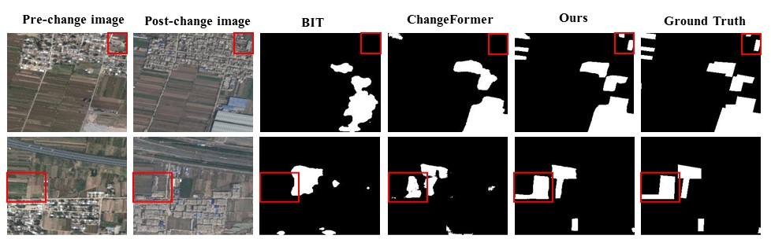
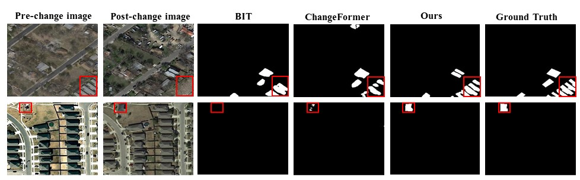

# ScratchFormer

# Remote Sensing Change Detection With Transformers Trained from Scratch (TGRS)
This repo contains the official **PyTorch** code for Remote Sensing Change Detection With Transformers Trained from Scratch [[Arxiv]](https://arxiv.org/pdf/2304.06710.pdf) [[TGRS]](https://ieeexplore.ieee.org/document/10489990). 

**Code is released!**

Highlights
-----------------
- **Trained From Scratch:** Our proposed solution for remote sensing change detection (CD) is called ScratchFormer, which utilizes a transformers-based Siamese architecture. Notably, ScratchFormer does not depend on pretrained weights or the need to train on another CD dataset.
change detection (CD).
- **Shuffled Sparse Attention:** The proposed ScratchFormer model incorporates a novel operation called shuffled sparse attention (SSA), which aims to improve the model's ability to focus on sparse informative regions that are important for the remote sensing change detection (CD) task.
- **Change-Enhanced Feature Fusion:** In addition, we present a change-enhanced feature fusion module (CEFF) that utilizes per-channel re-calibration to improve the relevant features for semantic changes, while reducing the impact of noisy features.

Methods
-----------------


Introduction
-----------------
Current transformer-based change detection (CD) approaches either employ a pre-trained model trained on large-scale image classification ImageNet dataset or rely on first pre-training on another CD dataset and then fine-tuning on the target benchmark. This current strategy is driven by the fact that transformers typically require a large amount of training data to learn inductive biases, which is insufficient in standard CD datasets due to their small size. We develop an end-to-end CD approach with transformers that is trained from scratch and yet achieves state-of-the-art performance on four benchmarks. Instead of using conventional self-attention that struggles to capture inductive biases when trained from scratch, our architecture utilizes a shuffled sparse-attention operation that focuses on selected sparse informative regions to capture the inherent characteristics of the CD data. Moreover, we introduce a change-enhanced feature fusion (CEFF) module to fuse the features from input image pairs by performing a per-channel re-weighting. Our CEFF module aids in enhancing the relevant semantic changes while suppressing the noisy ones. Extensive experiments on four CD datasets reveal the merits of the proposed contributions, achieving gains as high as 14.27% in intersection-over-union (IoU) score, compared to the best-published results in the literature.


Visualization results of ScratchFormer
-----------------

<table>
  <tr>
    <td></td>
  </tr>
  <tr>
    <td></td>
  </tr>
</table>

### Requirements
```
Python 3.8.0
pytorch 1.10.1
torchvision 0.11.2
einops  0.3.2
```

Please see `requirements.txt` for all the other requirements.

### :speech_balloon: Dataset Preparation

### :point_right: Data structure

```
"""
Change detection data set with pixel-level binary labels；
├─A
├─B
├─label
└─list
"""
```

`A`: images of t1 phase;

`B`:images of t2 phase;

`label`: label maps;

`list`: contains `train.txt, val.txt and test.txt`, each file records the image names (XXX.png) in the change detection dataset.


## Citation

```
@inproceedings{noman2023scratchformer,
  title={Remote Sensing Change Detection with Transformers Trained from Scratch},
  author={Noman, Mubashir and Fiaz, Mustansar and Cholakkal, Hisham and Narayan, Sanath and Anwer, Rao Muhammad and Khan, Salman and Khan, Fahad Shahbaz},
  journal={IEEE Transactions on Geoscience and Remote Sensing},
  year={2024}
}
```

### Contact

If you have any question, please feel free to contact the authors. Mustansar Fiaz: [mustansar.fiaz@mbzuai.ac.ae](mailto:mustansar.fiaz@mbzuai.ac.ae) or Mubashir Noman: [mubashir.noman@mbzuai.ac.ae](mailto:mubashir.noman@mbzuai.ac.ae).

## References
Our code is based on [ChangeFormer](https://github.com/wgcban/ChangeFormer) repository. 
We thank them for releasing their baseline code.


* **ScratchFormer**: "Remote Sensing Change Detection with Transformers Trained from Scratch", TGRS, 2024 (*MBZUAI*). [[Paper](https://arxiv.org/pdf/2304.06710.pdf)][[PyTorch](https://github.com/mustansarfiaz/ScratchFormer)]
